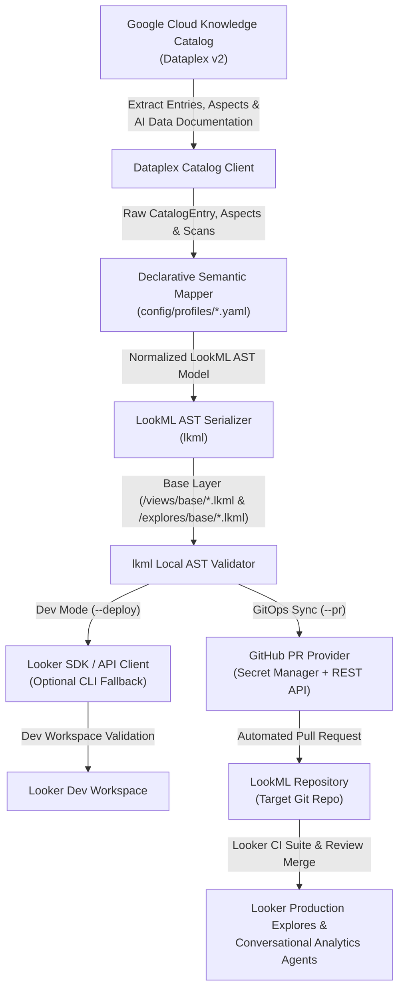

# Knowledge Catalog to LookML (Looker) Synchronization Engine

The Knowledge Catalog to LookML (Looker) Synchronization Engine automates the ingestion of data governance, semantic curation, and business glossary metadata from Google Cloud Knowledge Catalog (Dataplex) into production-ready LookML views and models.

The system is optimized to provide rich metadata for Looker semantic models, mapping catalog aspects directly into LookML parameters (e.g. `label`, `description`, `synonyms`, `suggestions`).

## Architecture



## Key Features

- **Declarative Mapping Engine**: Profile-driven architecture (`config/profiles/*.yaml`) decoupling source catalog taxonomy from LookML generation. Supports Dataplex custom aspects, Collibra outbound sync schemas, and native Dataplex metadata. See [docs/PROFILES.md](docs/PROFILES.md) for complete schema and configuration guide.
- **Knowledge Catalog AI Data Documentation (Gemini Descriptions)**:
  - Automatically ingests Gemini-powered Dataplex `DATA_DOCUMENTATION` scan outputs, including dataset/table overviews and column-level descriptions.
  - Dual extraction support: captures both native catalog-published aspect payloads (`descriptions`) attached directly to Dataplex entries and live `DataScanServiceClient` scan results.
  - Governed fallback cascade: when certified fields or tables lack manual business descriptions in `semantic-curation` or BigQuery schema annotations, the engine automatically populates LookML `description` attributes from AI documentation (`use_ai_data_documentation: true`), ensuring complete conversational context without overriding human stewardship.
- **Explore Scoping & Governance Controls (`explore_policy`)**:
  - Declaratively scopes LookML explore generation to designated business/fact entities using selection strategies (`tagged`, `allowlist`, `patterns`, `root_only`, `all`), preventing Looker explore bloat.
  - Automatically identifies and excludes dimension tables (`dim_*` prefixes, `dimension` tags, or leaf join targets) from standalone explores while preserving them as base views for star-schema joins.
  - Supports CLI (`--explore-table`) and configuration (`explore_tables`) allowlist overrides.
- **Conversational Analytics Enablement**:
  - Idiomatic LookML visibility: certified fields are exposed by default, while uncertified fields declare `hidden: yes` to avoid field bloat.
  - Populates natural language `label`, `description`, and `synonyms` for conversational grounding.
  - Generates discrete categorical `suggestions` when unique values are `< 10` (or tagged as exhaustive/closed lists), eliminating runtime sampling queries.
  - Formats metrics with native `value_format_name` mappings (e.g. `usd`, `percent_2`).
- **Two-Layer Refinement Architecture**:
  - `views/base/*.base.view.lkml` & `explores/base/*.base.explore.lkml`: Fully machine-generated base views and base explores (with star-schema `join:` relationships from `LookupContext` / `DATA_DOCUMENTATION` and partition/cluster filter rules) synced directly from Knowledge Catalog.
  - `views/curated/*.view.lkml`: Human-authored LookML refinements (`view: +table`), preserving custom measures, drill paths, and composite calculations across automated syncs without modifying base files or duplicating namespaces.
- **BigQuery Partition & Cluster Optimization**:
  - Automatically detects BigQuery table partitioning and clustering keys from Dataplex catalog metadata.
  - Synthesizes dedicated LookML `filter:` fields (`auto_generate_partition_cluster_filters`) with condition Liquid tags:
    `sql:  ${<col>_raw}  ;;`
  - Targets un-truncated raw timeframes (`${<col>_raw}`) or explicit field type references (`${<col>::date}`) to prevent Looker from casting timeframes to strings, guaranteeing direct database partition pruning on BigQuery without type mismatch.
  - Automatically omits `suggest_dimension` on date/numeric filters (restricting suggestions strictly to categorical string filters).
  - Tags dimensions with `partition_key` / `cluster_key` and optionally enforces explore-level partition filters (`always_filter_on_partition_key`) with configurable defaults (e.g. `"30 days"`).
- **Native Tooling & Deduplicated GitOps CI/CD**:
  - Validates generated LookML syntax locally with `lkml` prior to remote staging.
  - Development Mode (`--deploy`): Uses the official Looker SDK (Looker 4.0 API, with `looker-cli` as local fallback) for authenticated dev-workspace checkout, directory creation, file deployment, and project validation (`validate_project`).
  - Production GitOps (`--pr`): Sync bot runs headlessly (via GitHub REST API with Secret Manager tokens) to create or update existing `kc-sync/*` Pull Requests (`PATCH` + force-push) scoped strictly to machine-managed base views and base explores without requiring Looker instance credentials during sync.
  - Automated Looker CI: Downstream LookML repositories are expected to run [Looker CI Suites](https://docs.cloud.google.com/looker/docs/ci-create-suite) on PR updates as an additional validation gate before merging to production.

## Repository Structure

```
looker-kc/
├── .dockerignore                      # Container build ignore rules
├── .env.example                       # Environment variable reference template
├── .gitignore                         # Git ignore rules
├── .resources/
│   └── ROADMAP_FEATURES.md            # Deferred Data Quality, Tier & Governance roadmap specs
├── Dockerfile                         # Cloud Run container definition
├── README.md                          # Architecture and operational documentation
├── main.py                            # CLI entrypoint wrapper
├── pyproject.toml                     # Python package metadata and dependencies
├── requirements.txt                   # Pinned dependency requirements
├── docs/                              # Detailed architecture documentation
│   └── PROFILES.md                    # Declarative mapping profiles guide & schema
├── config/
│   ├── sync_config.yaml.example       # Configuration template
│   ├── aspect_types/                  # Dataplex Aspect Type definitions
│   │   └── semantic_curation_template.json
│   ├── aspects/                       # Aspect attachment payload examples
│   └── profiles/                      # Declarative mapping profiles
│       ├── semantic_curation.yaml     # Reference aspect mapping profile
│       ├── collibra_outbound.yaml     # Collibra outbound sync profile
│       └── dataplex_native.yaml       # Native Dataplex curation profile
├── src/
│   └── looker_kc_sync/
│       ├── cli.py                     # CLI entrypoint (sync, scaffold, validate)
│       ├── orchestrator.py            # End-to-end sync coordinator & env resolution
│       ├── protocols.py               # Structural Protocol definitions for sources & sinks
│       ├── clients/
│       │   ├── dataplex.py            # Dataplex Catalog & DataScan API client
│       │   ├── git_provider.py        # Deduplicated GitHub PR provider & Secret Manager client
│       │   └── looker.py              # Looker SDK (Looker 4.0 API) & looker-cli fallback wrapper
│       ├── generator/
│       │   └── engine.py              # lkml AST serialization & validation (views, explores, models)
│       ├── mapping/
│       │   ├── engine.py              # Core semantic mapping engine (views & base explores)
│       │   ├── profile.py             # Pydantic schema for profiles
│       │   ├── rules.py               # Certification & exclusion rules
│       │   └── transformers.py        # Value formatters & list parsers
│       └── models/
│           ├── catalog.py             # Dataplex entry & join relationship data models
│           └── lookml.py              # LookML component data models (views, filters, explores)
└── tests/                             # Unit tests
    ├── test_generator.py
    ├── test_git_provider.py
    ├── test_looker_client.py
    ├── test_mapping_engine.py
    └── test_orchestrator.py
```

## Quick Start

### 1. Requirements & Installation

- Python >= 3.11
- Google Cloud SDK (`gcloud`) authenticated to target GCP project (with permissions for Dataplex and Secret Manager)
- Authentication credentials based on execution mode:
  - **GitOps Pull Request Mode (`--pr`, Default for Serverless / Cloud Run)**: GitHub Personal Access Token with repo/PR permissions (stored in Secret Manager or set as `GITHUB_TOKEN`). Looker instance credentials are not required during synchronization.
  - **Direct Looker Dev Mode (`--deploy`)**: Looker API credentials (`LOOKERSDK_BASE_URL`, `LOOKERSDK_CLIENT_ID`, `LOOKERSDK_CLIENT_SECRET` via environment variables or `looker.ini`), or `looker-cli` configured with instance credentials.

Install project dependencies using `uv` (recommended) or `pip`:

```bash
# Using uv (recommended)
uv sync

# Or using pip
pip install -r requirements.txt
pip install -e .
```

### 2. Configuration (`config/sync_config.yaml`)

> [!NOTE]
> Both `config/sync_config.yaml` and `.env` are gitignored to prevent committing environment-specific project IDs, credentials, and repository targets. `config/sync_config.yaml.example` and `.env.example` serve as version-controlled templates. If `config/sync_config.yaml` is omitted, the sync engine automatically falls back to `config/sync_config.yaml.example` and populates values from environment variables or `.env`.

Copy the example configuration or set environment variables:

```bash
cp config/sync_config.yaml.example config/sync_config.yaml
cp .env.example .env
```

`config/sync_config.yaml` supports environment variable expansion (`${VAR:-default}`):

```yaml
project_id: "${PROJECT_ID:-<PROJECT_ID>}"
location: "${LOCATION:-us-central1}"
dataset_id: "${DATASET_ID:-<BIGQUERY_DATASET_ID>}"
looker_project_id: "${LOOKER_PROJECT_ID:-<LOOKER_PROJECT_ID>}"
git_repo: "${GIT_REPO:-<GITHUB_OWNER>/<REPO_NAME>}"
git_base_branch: "${GIT_BASE_BRANCH:-master}"
connection_name: "${CONNECTION_NAME:-<LOOKER_CONNECTION_NAME>}"
model_name: "${MODEL_NAME:-retail}"
active_profile: "config/profiles/semantic_curation.yaml"
output_dir: "${OUTPUT_DIR:-output}"
# Optional table allowlist override for LookML explore generation
# explore_tables:
#   - "orders"
```

### 3. Run Synchronization

```bash
# Execute end-to-end extraction, LookML rendering, and local Looker dev deployment
uv run looker-kc-sync sync --config config/sync_config.yaml

# Run without remote deployment (generate local LookML files only)
uv run looker-kc-sync sync --config config/sync_config.yaml --no-deploy

# Run with automated GitOps Pull Request creation
uv run looker-kc-sync sync --config config/sync_config.yaml --no-deploy --pr

# Scope base explore generation to specific tables (overriding profile explore_policy)
uv run looker-kc-sync sync --config config/sync_config.yaml --explore-table orders --pr
```

### 4. Validate Project in Looker

Run server-side LookML project validation against the Looker dev workspace via the Looker SDK API (or local `looker-cli` fallback):

```bash
uv run looker-kc-sync validate --project <LOOKER_PROJECT_ID>
```

### 5. Running Tests

```bash
uv run python -m unittest discover tests
```

## Knowledge Catalog AI Data Documentation

Google Cloud Knowledge Catalog features built-in AI Data Documentation scans powered by Gemini. When triggered, Dataplex analyzes the underlying BigQuery table data, distributions, and query patterns to generate:
- Comprehensive natural language **table overviews**.
- Column-level **semantic descriptions** explaining business context, units, and usage.

### 1. Dual Ingestion Pathways

The synchronization engine supports two complementary pathways to ingest AI documentation:

1. **Catalog-Published Aspects (`descriptions`)**:
   When datascans are configured with `--enable-catalog-publishing`, Dataplex publishes the documentation as a native `descriptions` aspect directly on the catalog entry. The sync engine automatically unpacks this aspect from `entry.aspects`, allowing serverless execution (e.g. Cloud Run) without requiring elevated DataScan read permissions.
2. **Live DataScan Service Enrichment**:
   The engine's `DataplexCatalogClient` inspects active `DATA_DOCUMENTATION` scans within the dataset via `DataScanServiceClient` to enrich catalog entries dynamically.

### 2. Governed Description Cascades

AI Data Documentation is designed as a governed backfill that respects human curation:

```yaml
use_ai_data_documentation: true

field_mappings:
  description:
    sources:
      - path: "semantic-curation.business_description" # 1. Human-curated governance (Highest priority)
      - path: "column.description"                     # 2. Native BigQuery column description
      - path: "data-documentation.description"         # 3. Gemini AI Data Documentation fallback
```

- **Table Overviews**: If `business_description` is omitted on a table, the engine falls back to `data-documentation.overview` for the LookML view description and explore description.
- **Field Descriptions**: Certified dimensions lacking a manual business description automatically backfill from `data-documentation.description`.
- **Governed Base Layer Invariant**: Uncertified columns (`is_certified: false`) remain `hidden: yes` and unannotated, ensuring AI descriptions only expose certified data assets.

```lookml
# Example: Certified field with no manual business description backfilled by AI
dimension: shipping_amount {
  type: number
  sql: ${TABLE}.shipping_amount ;;
  label: "Shipping Amount"
  description: "This column stores the monetary cost associated with shipping the order."
  tags: ["certified", "shipping"]
  value_format_name: usd
}
```

## Cloud Deployment (Cloud Run & Cloud Scheduler)

Automate scheduled catalog synchronization and GitOps Pull Request creation using Google Cloud serverless infrastructure. In serverless deployment, the sync engine runs with `--no-deploy --pr` to commit generated base views directly to a feature branch and open a GitHub Pull Request for team review.

### 1. Secret Manager Setup (GitHub Token)

To allow the sync engine to push feature branches and open Pull Requests against the LookML repository, store a GitHub Personal Access Token (PAT) with `Contents: Read and write` and `Pull requests: Read and write` in Google Cloud Secret Manager. The engine resolves the token via the `google-cloud-secret-manager` Python client using the job's service account credentials (ADC):

```bash
# Create the secret
gcloud secrets create GITHUB_TOKEN \
  --project="<PROJECT_ID>" \
  --replication-policy="automatic"

# Add the token payload
echo -n "<YOUR_GITHUB_TOKEN>" | gcloud secrets versions add GITHUB_TOKEN \
  --project="<PROJECT_ID>" \
  --data-file=-

# Grant Secret Accessor role to the execution service account
gcloud secrets add-iam-policy-binding GITHUB_TOKEN \
  --project="<PROJECT_ID>" \
  --member="serviceAccount:<SERVICE_ACCOUNT_EMAIL>" \
  --role="roles/secretmanager.secretAccessor"
```

### 2. Deploy Cloud Run Job

Package and deploy the synchronization engine as a Cloud Run Job:

```bash
# Build container image via Cloud Build using Artifact Registry
gcloud builds submit --tag "<REGION>-docker.pkg.dev/<PROJECT_ID>/<REPOSITORY>/looker-kc-sync:latest"

# Create Cloud Run Job
gcloud run jobs create kc-looker-sync-job \
  --project="<PROJECT_ID>" \
  --region="<REGION>" \
  --image="<REGION>-docker.pkg.dev/<PROJECT_ID>/<REPOSITORY>/looker-kc-sync:latest" \
  --args="sync,--config,config/sync_config.yaml,--no-deploy,--pr" \
  --set-env-vars="PROJECT_ID=<PROJECT_ID>,DATASET_ID=<BIGQUERY_DATASET_ID>,LOOKER_PROJECT_ID=<LOOKER_PROJECT_ID>,GIT_REPO=<GITHUB_OWNER>/<LOOKML_REPO>" \
  --service-account="<SERVICE_ACCOUNT_EMAIL>" \
  --max-retries=1
```

### 3. Schedule with Cloud Scheduler

Trigger periodic synchronization (e.g., every 6 hours) by creating a Cloud Scheduler job targeting the Cloud Run Job API:

```bash
gcloud scheduler jobs create http kc-looker-sync-trigger \
  --project="<PROJECT_ID>" \
  --location="<REGION>" \
  --schedule="0 */6 * * *" \
  --time-zone="Etc/UTC" \
  --uri="https://<REGION>-run.googleapis.com/apis/run.googleapis.com/v1/namespaces/<PROJECT_ID>/jobs/kc-looker-sync-job:run" \
  --http-method=POST \
  --oauth-service-account-email="<SCHEDULER_SERVICE_ACCOUNT_EMAIL>"
```

## Automated Looker CI Validation on Pull Requests

When running in GitOps mode (`--pr`), the synchronization engine creates and updates Pull Requests against the target LookML repository with generated base views and explores.

To enforce semantic integrity and prevent breaking changes from reaching production, downstream LookML repositories are expected to configure automated [Looker CI Suites](https://docs.cloud.google.com/looker/docs/ci-create-suite) (invoked via GitHub Actions, webhooks, or the Looker API on PR updates):

1. **Model & Explore Validation**: Looker validates all models against the Pull Request feature branch, verifying that new base explores, joined views, and Liquid conditional filters (` ... `) compile cleanly.
2. **Refinement Compatibility**: Verifies that human-authored refinements in `views/curated/*.view.lkml` cleanly layer over newly synchronized fields in `views/base/*.base.view.lkml`.
3. **Data Tests Execution**: Runs project-defined LookML `test:` blocks to verify that data contracts and core assumptions hold true before merging to `main`.

