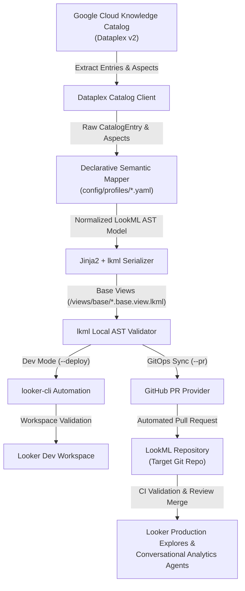

# Knowledge Catalog to LookML (Looker) Synchronization Engine

The Knowledge Catalog to LookML (Looker) Synchronization Engine automates the ingestion of data governance, semantic curation, and business glossary metadata from Google Cloud Knowledge Catalog (Dataplex) into production-ready LookML views and models.

The system is optimized to provide rich metadata for Looker semantic models, mapping catalog aspects directly into LookML parameters (e.g. `label`, `description`, `synonyms`, `suggestions`).

## Architecture



## Key Features

- **Declarative Mapping Engine**: Profile-driven architecture (`config/profiles/*.yaml`) decoupling source catalog taxonomy from LookML generation. Supports Dataplex custom aspects, Collibra outbound sync schemas, and native Dataplex metadata. See [docs/PROFILES.md](docs/PROFILES.md) for complete schema and configuration guide.
- **Conversational Analytics Enablement**:
  - Automatically sets `fields_hidden_by_default: yes` at the view level to avoid field bloat.
  - Selectively unhides only certified fields (`hidden: no`) satisfying governance rules.
  - Populates natural language `label`, `description`, and `synonyms` for conversational grounding.
  - Generates discrete categorical `suggestions` from allowed value lists, eliminating runtime sampling queries.
  - Formats metrics with native `value_format_name` mappings (e.g. `usd`, `percent_2`).
- **Two-Layer Refinement Architecture**:
  - `views/base/*.base.view.lkml`: Fully machine-generated base views (`view: table`) containing dimensions, measures, and conversational parameters synced directly from Knowledge Catalog.
  - `views/curated/*.view.lkml`: Human-authored LookML refinements (`view: +table`), preserving custom measures, drill paths, and composite calculations across automated syncs without modifying base files or duplicating namespaces.
- **Native Tooling & GitOps CI/CD**:
  - Validates generated LookML syntax locally with `lkml` prior to remote staging.
  - Development Mode: Uses `looker-cli` directly for authenticated directory creation, dev-branch checkout, file deployment, and project validation (`validate_project`).
  - Production GitOps: Sync bot creates dedicated feature branches (`kc-sync/update-...`) and opens automated GitHub Pull Requests scoped strictly to base views, allowing repository CI/CD pipelines (e.g. Looker CI) and analytics engineers to review changes before merging to production.

## Repository Structure

```
looker-kc/
├── .dockerignore                      # Container build ignore rules
├── .env.example                       # Environment variable reference template
├── .gitignore                         # Git ignore rules
├── Dockerfile                         # Cloud Run container definition
├── README.md                          # Architecture and operational documentation
├── main.py                            # CLI entrypoint wrapper
├── pyproject.toml                     # Python package metadata and dependencies
├── requirements.txt                   # Pinned dependency requirements
├── docs/                              # Detailed architecture documentation
│   └── PROFILES.md                    # Declarative mapping profiles guide & schema
├── config/
│   ├── sync_config.yaml.example       # Configuration template
│   ├── aspect_types/                  # Dataplex Aspect Type definitions
│   │   └── semantic_curation_template.json
│   ├── aspects/                       # Aspect attachment payload examples
│   └── profiles/                      # Declarative mapping profiles
│       ├── semantic_curation.yaml     # Reference aspect mapping profile
│       ├── collibra_outbound.yaml     # Collibra outbound sync profile
│       └── dataplex_native.yaml       # Native Dataplex curation profile
├── src/
│   └── looker_kc_sync/
│       ├── cli.py                     # CLI entrypoint (sync, validate)
│       ├── orchestrator.py            # End-to-end sync coordinator & env resolution
│       ├── clients/
│       │   ├── dataplex.py            # Dataplex Catalog API client
│       │   ├── git_provider.py        # GitHub PR provider & Secret Manager client
│       │   └── looker.py              # looker-cli wrapper (dev mode)
│       ├── generator/
│       │   ├── engine.py              # Jinja2 template rendering + lkml validation
│       │   └── templates/             # LookML templates (base view, refinement, model)
│       ├── mapping/
│       │   ├── engine.py              # Core semantic mapping engine
│       │   ├── profile.py             # Pydantic schema for profiles
│       │   ├── rules.py               # Certification & exclusion rules
│       │   └── transformers.py        # Value formatters & list parsers
│       └── models/
│           ├── catalog.py             # Dataplex entry data models
│           └── lookml.py              # LookML component data models
└── tests/                             # Unit tests
    ├── test_generator.py
    └── test_mapping_engine.py
```

## Quick Start

### 1. Requirements & Installation

- Python >= 3.11
- Google Cloud SDK (`gcloud`) authenticated to target GCP project
- `looker-cli` installed and configured with instance credentials (for local dev mode deployment)

Install project dependencies using `uv` (recommended) or `pip`:

```bash
# Using uv (recommended)
uv sync

# Or using pip
pip install -r requirements.txt
pip install -e .
```

### 2. Configuration (`config/sync_config.yaml`)

> [!NOTE]
> Both `config/sync_config.yaml` and `.env` are gitignored to prevent committing environment-specific project IDs, credentials, and repository targets. `config/sync_config.yaml.example` and `.env.example` serve as version-controlled templates. If `config/sync_config.yaml` is omitted, the sync engine automatically falls back to `config/sync_config.yaml.example` and populates values from environment variables or `.env`.

Copy the example configuration or set environment variables:

```bash
cp config/sync_config.yaml.example config/sync_config.yaml
cp .env.example .env
```

`config/sync_config.yaml` supports environment variable expansion (`${VAR:-default}`):

```yaml
project_id: "${PROJECT_ID:-<PROJECT_ID>}"
location: "${LOCATION:-us-central1}"
dataset_id: "${DATASET_ID:-<BIGQUERY_DATASET_ID>}"
looker_project_id: "${LOOKER_PROJECT_ID:-<LOOKER_PROJECT_ID>}"
git_repo: "${GIT_REPO:-<GITHUB_OWNER>/<REPO_NAME>}"
git_base_branch: "${GIT_BASE_BRANCH:-master}"
connection_name: "${CONNECTION_NAME:-<LOOKER_CONNECTION_NAME>}"
model_name: "${MODEL_NAME:-retail}"
active_profile: "config/profiles/semantic_curation.yaml"
output_dir: "${OUTPUT_DIR:-output}"
```

### 3. Run Synchronization

```bash
# Execute end-to-end extraction, LookML rendering, and local Looker dev deployment
uv run looker-kc-sync sync --config config/sync_config.yaml

# Run without remote deployment (generate local LookML files only)
uv run looker-kc-sync sync --config config/sync_config.yaml --no-deploy

# Run with automated GitOps Pull Request creation
uv run looker-kc-sync sync --config config/sync_config.yaml --no-deploy --pr
```

### 4. Validate Project in Looker

```bash
uv run looker-kc-sync validate --project <LOOKER_PROJECT_ID>
```

### 5. Running Tests

```bash
uv run python -m unittest discover tests
```

## Cloud Deployment (Cloud Run & Cloud Scheduler)

Automate scheduled catalog synchronization and GitOps Pull Request creation using Google Cloud serverless infrastructure. In serverless deployment, the sync engine runs with `--no-deploy --pr` to commit generated base views directly to a feature branch and open a GitHub Pull Request for team review.

### 1. Secret Manager Setup (GitHub Token)

To allow the sync engine to push feature branches and open Pull Requests against the LookML repository, store a GitHub Personal Access Token (PAT) with `Contents: Read and write` and `Pull requests: Read and write` in Google Cloud Secret Manager. The engine resolves the token via the `google-cloud-secret-manager` Python client using the job's service account credentials (ADC):

```bash
# Create the secret
gcloud secrets create GITHUB_TOKEN \
  --project="<PROJECT_ID>" \
  --replication-policy="automatic"

# Add the token payload
echo -n "<YOUR_GITHUB_TOKEN>" | gcloud secrets versions add GITHUB_TOKEN \
  --project="<PROJECT_ID>" \
  --data-file=-

# Grant Secret Accessor role to the execution service account
gcloud secrets add-iam-policy-binding GITHUB_TOKEN \
  --project="<PROJECT_ID>" \
  --member="serviceAccount:<SERVICE_ACCOUNT_EMAIL>" \
  --role="roles/secretmanager.secretAccessor"
```

### 2. Deploy Cloud Run Job

Package and deploy the synchronization engine as a Cloud Run Job:

```bash
# Build container image via Cloud Build using Artifact Registry
gcloud builds submit --tag "<REGION>-docker.pkg.dev/<PROJECT_ID>/<REPOSITORY>/looker-kc-sync:latest"

# Create Cloud Run Job
gcloud run jobs create kc-looker-sync-job \
  --project="<PROJECT_ID>" \
  --region="<REGION>" \
  --image="<REGION>-docker.pkg.dev/<PROJECT_ID>/<REPOSITORY>/looker-kc-sync:latest" \
  --args="sync,--config,config/sync_config.yaml,--no-deploy,--pr" \
  --set-env-vars="PROJECT_ID=<PROJECT_ID>,DATASET_ID=<BIGQUERY_DATASET_ID>,LOOKER_PROJECT_ID=<LOOKER_PROJECT_ID>,GIT_REPO=<GITHUB_OWNER>/<LOOKML_REPO>" \
  --service-account="<SERVICE_ACCOUNT_EMAIL>" \
  --max-retries=1
```

### 3. Schedule with Cloud Scheduler

Trigger periodic synchronization (e.g., every 6 hours) by creating a Cloud Scheduler job targeting the Cloud Run Job API:

```bash
gcloud scheduler jobs create http kc-looker-sync-trigger \
  --project="<PROJECT_ID>" \
  --location="<REGION>" \
  --schedule="0 */6 * * *" \
  --time-zone="Etc/UTC" \
  --uri="https://<REGION>-run.googleapis.com/apis/run.googleapis.com/v1/namespaces/<PROJECT_ID>/jobs/kc-looker-sync-job:run" \
  --http-method=POST \
  --oauth-service-account-email="<SCHEDULER_SERVICE_ACCOUNT_EMAIL>"
```
