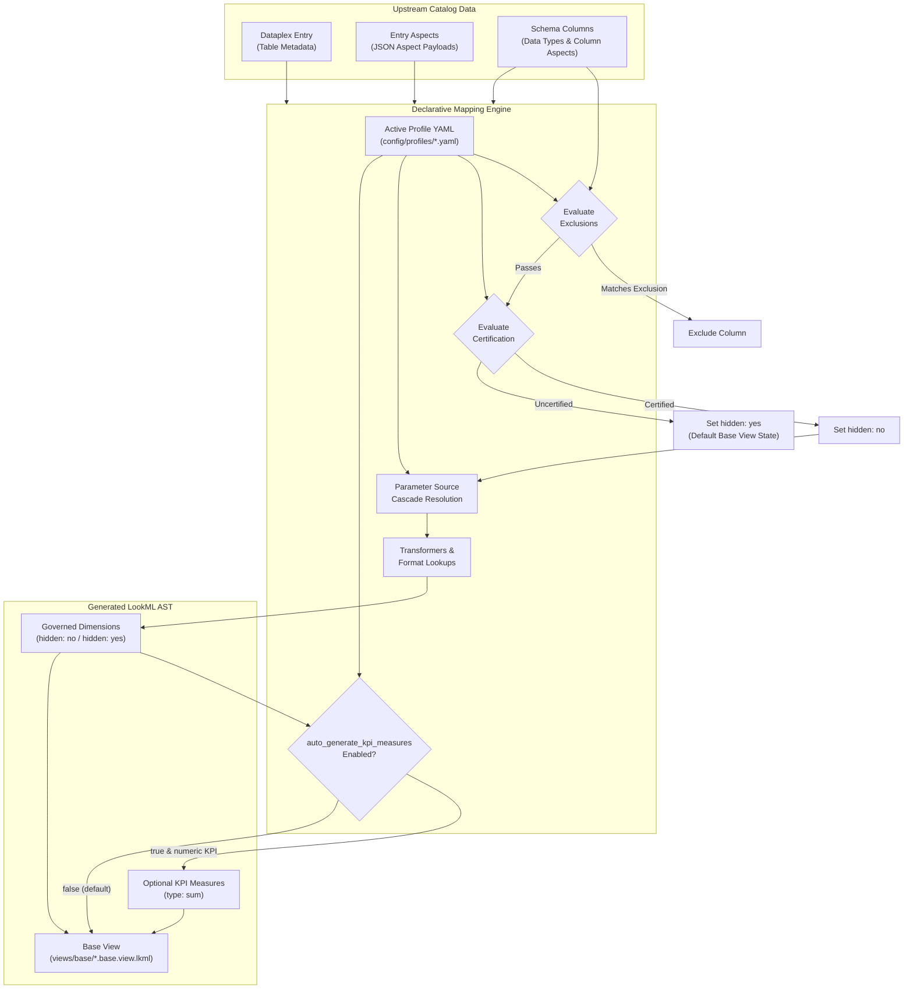

# Declarative Mapping Profiles

This document explains the architecture, schema, resolution engine, and configuration of mapping profiles in the Knowledge Catalog to Looker synchronization engine.

---

## Overview

The synchronization engine uses a profile-driven declarative architecture (`config/profiles/*.yaml`) to map metadata from Google Cloud Knowledge Catalog (Dataplex) into LookML views and parameters.

Organizations maintain catalog metadata across varied schemas:
- Custom Dataplex aspect types (e.g. `semantic-curation`).
- Third-party catalog ingestion feeds (e.g. Collibra synced to Dataplex).
- Native Dataplex stewardship, policy tags, and BigQuery schema annotations.

Rather than hardcoding transformation logic for each catalog schema, mapping profiles decouple source metadata structures from LookML generation. A profile defines how to identify certified entities, which columns to exclude, how to resolve LookML parameters through fallback cascades, and how to format data types for Looker Conversational Analytics.

---

## Architecture and Data Flow



---

## Profile Schema Specification

Each profile is a YAML document validated against the `MappingProfile` Pydantic model (`src/looker_kc_sync/mapping/profile.py`).

### Top-Level Fields

| Field | Type | Required | Default | Description |
| :--- | :--- | :--- | :--- | :--- |
| `profile_name` | String | Yes | &mdash; | Unique identifier for the profile. |
| `description` | String | No | `""` | Human-readable explanation of the profile scope and source catalog. |
| `auto_generate_kpi_measures` | Boolean | No | `false` | When true, automatically synthesizes aggregate `type: sum` measures for certified numeric fields matching financial/KPI keywords. |
| `use_dimension_groups` | Boolean | No | `true` | When true, automatically maps temporal columns (`TIMESTAMP`, `DATETIME`, `DATE`) to LookML `dimension_group` fields of `type: time`. |
| `default_timeframes` | List[String] | No | `["raw", "time", "date", "week", "month", "quarter", "year"]` | Timeframes generated for `TIMESTAMP` and `DATETIME` dimension groups. |
| `date_timeframes` | List[String] | No | `["raw", "date", "week", "month", "quarter", "year"]` | Timeframes generated for `DATE` dimension groups (omits time-of-day). |
| `certification_rule` | Object | Yes | &mdash; | Rule determining whether an entity is marked certified (`hidden: no`). |
| `exclusions` | List[Object] | No | `[]` | List of rules matching columns that must be dropped entirely from the generated view. |
| `field_mappings` | Object | No | `{}` | Parameter-level resolution rules for LookML field attributes. |

---

## Certification Rules

The `certification_rule` evaluates whether a table or column meets organizational data governance standards. When certified:
- The dimension receives `hidden: no`, making it visible to users and Looker Conversational Analytics agents.
- Rich semantic parameters (`label`, `description`, `synonyms`, `tags`, `suggestions`, `value_format_name`) are populated.

When uncertified:
- The dimension is set to `hidden: yes` (or remains hidden under the view-level `fields_hidden_by_default: yes`), preventing field bloat and hallucination in conversational queries.

### Schema

```yaml
certification_rule:
  path: "semantic-curation.status"
  operator: "equals"
  values: ["CERTIFIED"]
```

### Supported Operators

| Operator | Evaluation Logic | Example Value Match |
| :--- | :--- | :--- |
| `equals` | Case-insensitive string equality with any value in `values`. | `status == "CERTIFIED"` |
| `in` | Case-insensitive membership check in `values`. | `status in ["Approved", "Certified", "Accepted"]` |
| `not_equals` | Negated equality check across all values in `values`. | `status != "DEPRECATED"` |
| `exists` | Checks that the aspect or field path exists and is not null. | `path` is present |
| `boolean_true` | Truthiness evaluation on the resolved value. | `curated == true` |

---

## Exclusion Rules

Exclusion rules filter out unwanted, sensitive, or internal technical columns before LookML models are assembled.

### Schema

```yaml
exclusions:
  - path: "dataplex.policy_tags"
    operator: "contains"
    values: ["pii_restricted", "confidential_legal"]
  - path: "column.name"
    operator: "equals"
    values: ["_etl_checksum", "_fivetran_deleted"]
```

### Supported Operators

| Operator | Evaluation Logic |
| :--- | :--- |
| `contains` | Checks if any entry in `values` matches the target scalar value or is contained in the target list/array. |
| `equals` | Direct equality check between the target value and any element in `values`. |

---

## Field Parameter Mappings

Under `field_mappings`, each LookML parameter is configured with a cascade of source candidates and optional transformers.

### Source Resolution Cascade

The engine iterates through the `sources` array in sequential order. The first candidate that resolves to a non-empty, non-null value is selected:

```yaml
field_mappings:
  label:
    sources:
      - path: "semantic-curation.business_label"
      - path: "collibra_business_term.signifier"
      - transform: "title_case(column_name)"
```

In this example:
1. The engine checks `semantic-curation.business_label`. If populated, it is used.
2. If empty or absent, it checks `collibra_business_term.signifier`.
3. If still empty, it falls back to the built-in transform `title_case(column_name)`, converting `shipping_amount` to `Shipping Amount`.

### Mapping Source Types and Delimiters

When extracting multi-value fields (such as `synonyms` or `suggestions`), the `type` attribute specifies how the raw value should be parsed:

```yaml
synonyms:
  sources:
    - path: "collibra_business_term.aliases"
      type: "delimited_string"
      delimiter: ","
    - path: "semantic-curation.synonyms"
      type: "list"
```

| Type | Description |
| :--- | :--- |
| `string` (default) | Returns the raw scalar string value. |
| `list` | Extracts an existing JSON list or Python iterable, stripping whitespace from each element. |
| `delimited_string` | Splits a delimited string (e.g. `"revenue, sales, gross bookings"`) using the character in `delimiter`. |

### Lookup Maps (`lookup_map`)

Lookup dictionaries translate source catalog formatting strings into native Looker LookML identifiers.

```yaml
value_format_name:
  sources:
    - path: "semantic-curation.format_pattern"
  lookup_map:
    currency: "usd"
    usd: "usd"
    percent: "percent_2"
    percentage: "percent_2"
    decimal_0: "decimal_0"
    integer: "decimal_0"
```

If the upstream aspect contains `"currency"`, the mapping engine translates it to `value_format_name: usd`.

### Tag Mappings (`tags`)

Looker native tags are declared through a combination of static tags and dynamic tags extracted from aspect paths:

```yaml
tags:
  static_tags: ["certified"]
  dynamic_tags:
    - path: "semantic-curation.governance_tags"
    - path: "collibra_governance.status"
      prefix: "status_"
```

- `static_tags`: Added unconditionally to every certified field.
- `dynamic_tags`: Resolves scalar values or lists from the specified path. When `prefix` is specified, the resolved values are prefixed (e.g., `status_approved`).

---

## Path Resolution Engine

The mapping engine resolves JSON paths using a three-tier hierarchy:

1. **Direct Dictionary Key Match**:
   Exact key lookup within the current metadata scope (e.g. `column.name`, `column.description`).
2. **Dot-Notation Hierarchy**:
   Navigates nested dictionaries (e.g. `dataplex.overview.content`).
3. **Fuzzy Aspect Type Match**:
   Dataplex aspect type resource names include project numbers and regions, such as:
   `projects/<PROJECT_NUMBER>/locations/<REGION>/aspectTypes/semantic-curation`
   or are formatted in Dataplex JSON as `<PROJECT_NUMBER>.<REGION>.semantic-curation`.

   The resolver automatically:
   - Matches underscore-separated profile paths (e.g. `semantic_curation.status`) against hyphenated aspect identifiers (e.g. `semantic-curation`).
   - Traverses into the aspect payload regardless of project or regional prefix.

---

## KPI Measure Generation Control

The profile flag `auto_generate_kpi_measures` governs whether the machine-managed base view synthesizes aggregate measures:

```yaml
auto_generate_kpi_measures: false  # Recommended default
```

### When Set to `false` (Recommended)
- The base view strictly generates dimensions.
- Adheres to the Two-Layer Refinement architecture: base views represent the raw physical and governed schema, while all measures, business calculations, and metric logic remain authored by analytics engineers in `views/curated/*.view.lkml`.

### When Set to `true`
- For certified numeric columns matching KPI keywords (`amount`, `price`, `revenue`, `cost`, `total`, `sales`), the engine synthesizes a `type: sum` measure:
  ```lookml
  measure: total_shipping_amount {
    type: sum
    sql: ${TABLE}.shipping_amount ;;
    label: "Total Shipping Cost"
    description: "Sum of Shipping Cost."
    synonyms: ["total shipping fee", "total freight charge"]
    tags: ["certified", "kpi"]
    value_format_name: usd
  }
  ```

---

## Time Types and Dimension Groups

By default, `use_dimension_groups: true` is enabled across all profiles. The mapping engine automatically converts temporal columns (`TIMESTAMP`, `DATETIME`, `DATE`) into native Looker LookML `dimension_group` fields of `type: time`.

### Why Dimension Groups?
Instead of creating static scalar date dimensions (`type: date_time`) that require manual authoring of separate year, month, or week dimensions, a Looker `dimension_group` automatically generates a full suite of timeframes in the Looker Explore and field picker (e.g. `${order_date}`, `${order_week}`, `${order_month}`, `${order_year}`). This provides immediate conversational drill-down capabilities for Looker Conversational Analytics agents.

### Generated LookML Structure

```lookml
dimension_group: order {
  type: time
  timeframes: [raw, time, date, week, month, quarter, year]
  sql: ${TABLE}.order_date ;;
  datatype: timestamp
  hidden: no
  label: "Order Placed"
  description: "Timestamp when customer placed order."
  synonyms: ["purchase date", "transaction time", "order date"]
  tags: ["certified", "date"]
}
```

### Automatic Name Derivation & Collision Prevention
Looker synthesizes dimension names by concatenating the group name with the timeframe name (e.g. `order` + `date` &rarr; `order_date`).

1. **Suffix Stripping**:
   The engine automatically strips common temporal suffixes (`_date`, `_time`, `_at`, `_timestamp`, `_datetime`) from the column name to form the group name:
   - `order_date` &rarr; `dimension_group: order` (produces `${order_date}`, `${order_week}`, `${order_month}`)
   - `created_at` &rarr; `dimension_group: created` (produces `${created_date}`, `${created_week}`, etc.)
   - `shipment_timestamp` &rarr; `dimension_group: shipment`
2. **Namespace Collision Avoidance**:
   In LookML, field names within a view must be unique. If stripping a suffix would collide with an existing table column (e.g. a table containing both `status` and `status_date`), or another already assigned field, the engine preserves the original column name (`status_date`) to prevent duplicate identifier compilation errors.
3. **Redundant Label Cleanup**:
   In the Looker field picker, Looker appends the timeframe name to the `label` parameter (e.g. label `"Order Placed"` &rarr; `"Order Placed Date"`, `"Order Placed Month"`). If the upstream catalog label ends with `" Date"`, `" Time"`, or `" Timestamp"`, the engine strips the redundant suffix to avoid duplicate UI labels such as `"Order Placed Date Date"`.

### Profile Configuration

Profiles can customize timeframes or disable dimension groups if scalar dimensions are preferred:

```yaml
use_dimension_groups: true

# Timeframes for TIMESTAMP and DATETIME
default_timeframes:
  - "raw"
  - "time"
  - "date"
  - "week"
  - "month"
  - "quarter"
  - "year"

# Timeframes for DATE (omits time-of-day)
date_timeframes:
  - "raw"
  - "date"
  - "week"
  - "month"
  - "quarter"
  - "year"
```

---

## Reference Profiles

The repository provides three reference profiles in `config/profiles/`:

### 1. `semantic_curation.yaml` (Reference Standard)
Optimized for the Dataplex custom aspect `semantic-curation`.
- **Certification Rule**: `semantic-curation.status == "CERTIFIED"`
- **Exclusions**: `dataplex.policy_tags` containing `pii_restricted`
- **Label**: `semantic-curation.business_label` with fallback to `title_case(column_name)`
- **Synonyms**: Extracted directly from `semantic-curation.synonyms` array
- **Suggestions**: Extracted from `semantic-curation.allowed_values`
- **Format**: Maps `currency`, `percent`, `decimal_0` to Looker standard format names

### 2. `collibra_outbound.yaml`
Designed for enterprises syncing Collibra governance assets into Google Cloud Dataplex.
- **Certification Rule**: `collibra_governance.status in ["Approved", "Certified", "Accepted"]`
- **Label**: Fallback from `collibra_business_term.signifier` &rarr; `collibra_business_term.name` &rarr; `title_case(column_name)`
- **Description**: Fallback from `collibra_business_term.definition` &rarr; `collibra_business_term.description` &rarr; `column.description`
- **Synonyms**: Delimited string split on `,` from `collibra_business_term.aliases`
- **Tags**: Adds `source_collibra` static tag and dynamic `collibra_status:<status>` tags

### 3. `dataplex_native.yaml`
Designed for native Dataplex environments using built-in stewardship and BigQuery descriptions.
- **Certification Rule**: `dataplex_stewardship.curated == true`
- **Description**: Fallback from `dataplex_stewardship.description` &rarr; `dataplex.overview.content` &rarr; BigQuery column description
- **Label**: `dataplex_stewardship.display_name` &rarr; `title_case(column_name)`

---

## Creating a New Custom Profile

To add a new mapping profile for a custom catalog or aspect schema:

### Step 1: Inspect Upstream Aspect Schema
Retrieve a sample Dataplex entry with attached aspects using `gcloud` or the Dataplex API:
```bash
gcloud dataplex entries get <ENTRY_NAME> \
    --project=<PROJECT_ID> \
    --location=<REGION> \
    --entry-group=<ENTRY_GROUP> \
    --view=FULL
```

Identify the aspect names, keys, and values for:
- Certification status
- Business names or labels
- Field descriptions and synonyms
- Format patterns and allowed categorical values

### Step 2: Create the Profile YAML
Create `config/profiles/<my_profile>.yaml`:

```yaml
profile_name: "enterprise_governance"
description: "Custom mapping profile for enterprise data mesh"
auto_generate_kpi_measures: false

certification_rule:
  path: "enterprise_governance.compliance_status"
  operator: "equals"
  values: ["PRODUCTION_READY", "CERTIFIED"]

exclusions:
  - path: "enterprise_governance.classification"
    operator: "contains"
    values: ["RESTRICTED_PII", "INTERNAL_ONLY"]

field_mappings:
  label:
    sources:
      - path: "enterprise_governance.display_name"
      - transform: "title_case(column_name)"

  description:
    sources:
      - path: "enterprise_governance.definition"
      - path: "column.description"

  synonyms:
    sources:
      - path: "enterprise_governance.search_keywords"
        type: "list"

  tags:
    static_tags: ["governed"]
    dynamic_tags:
      - path: "enterprise_governance.domain"
        prefix: "domain_"

  value_format_name:
    sources:
      - path: "enterprise_governance.data_format"
    lookup_map:
      USD: "usd"
      PCT: "percent_2"
```

### Step 3: Activate the Profile
Set the active profile in `config/sync_config.yaml`:

```yaml
active_profile: "config/profiles/enterprise_governance.yaml"
```

Or pass via environment variable:
```bash
export ACTIVE_PROFILE="config/profiles/enterprise_governance.yaml"
```

### Step 4: Validate Locally
Run the test suite and execution dry run to verify parsing and AST generation:

```bash
# Run unit tests
pytest tests/test_mapping_engine.py

# Run dry-run sync locally
python3 main.py sync --config config/sync_config.yaml --dry-run
```
